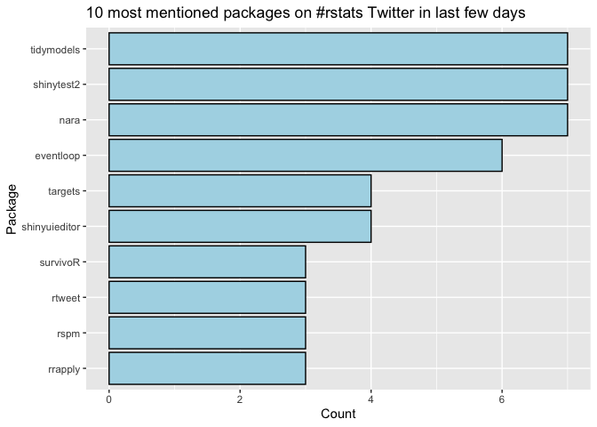

<!-- README.md is generated from README.Rmd. Please edit that file -->

# rstats-package-mentions

<!-- badges: start -->
<!-- badges: end -->

## Goal

The goal of rstats-package-mentions is to get package names mentioned in
\#rstats tweets within the past few days.

## Limitations

Filters for package names following the curly bracket syntax ({dplyr}
for example).

## Quick results

What packages were most frequently mentioned in Tweets from the last 7
days?

<!-- -->
